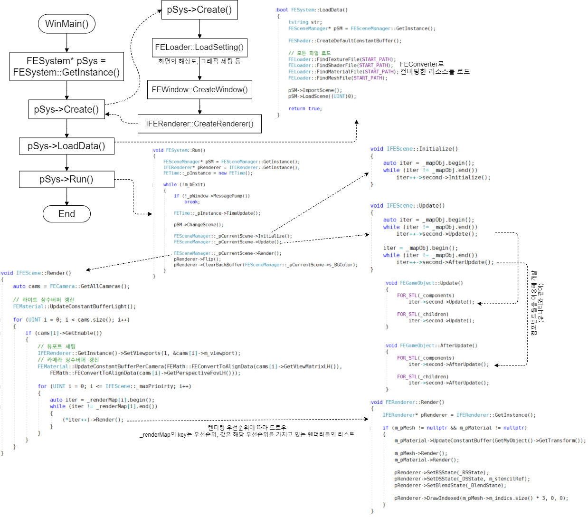
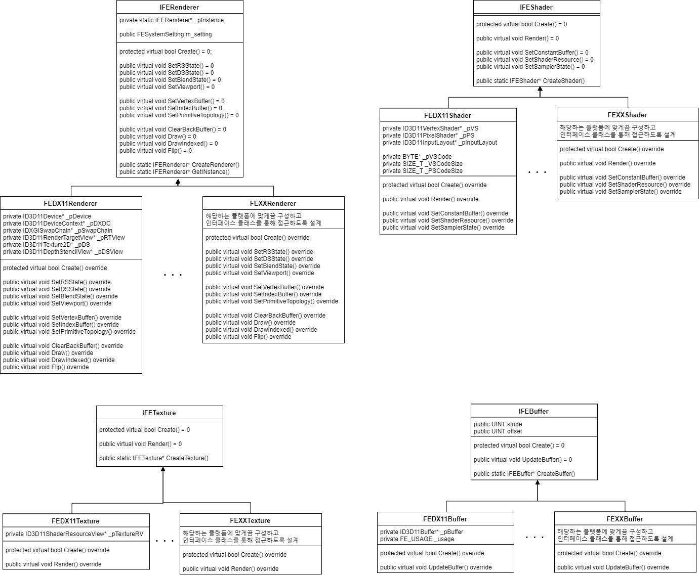

# 사용법
1. Data폴더에 사용할 리소스들을 담는다
2. SDK/FEFileConverter/FEFileConverter.bat 파일을 실행시켜 리소스들을 컨버팅한다 (경로는 bin/Resource)
    2.a 현재 셰이더코드는 자동으로 제작을 못하므로 수동으로 형식에 맞게 집어넣는다 (FEShaderSyntax.fes 참고)
    2.b 새로운 머테리얼을 파일형식으로 저장하고싶다면 수동으로 형식에 맞게 집어넣는다 (FEMaterialSyntax.fem 참고)
3. Scene 생성 (추후에 .scene 리소스 파일을 통해 읽도록 수정 필요)
    3.a 솔루션의 UserScene프로젝트에 IFEScenn 클래스를 상속받는 클래스를 작성한다
    3.b 작성한 클래스에 virtual void Load() override; 함수를 추가한다. (씬을 로드할때 이 함수가 호출된다)
    3.c Load() 함수에서 씬을 구성한다 (오브젝트 추가, 및 오브젝트에 컴포넌트 추가)
    3.d FEUserScene.cpp파일 내의 LoadUserScene() 함수에 pSM->AddScene(new SceneClass); 넣어준다 (Add 순서대로 Index 매겨짐)
4. 빌드 후 실행한다

# TriWorld(bin\Game.exe) 조작법
* 방향키 좌우키 : Y축 회전
* 방향키 상하키 : 전/후진
* C/V : 주인공(드워프) 위/아래 이동
* Z/X : 횟불 (포인트라이트) 반경 증/감소

- 1/2/3 : x/y/z 그리드 On/Off
- 4 : 노말 시각화 On/Off

+ F6 : 시간 변경
+ F7 : 계절 변경
+ F8 : Scene 변경 (AnimScene으로)

* WASD : 카메라 이동
* IJKL : 카메라 회전

# 01_EngineFlowChart.png

# 02_RendererDiagram.png

# 03_ObjectDiagram.png

